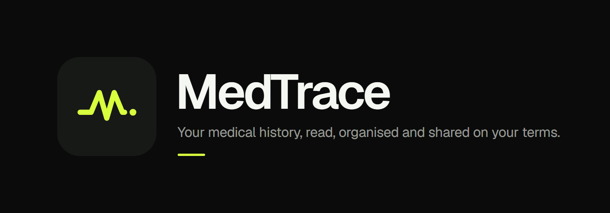
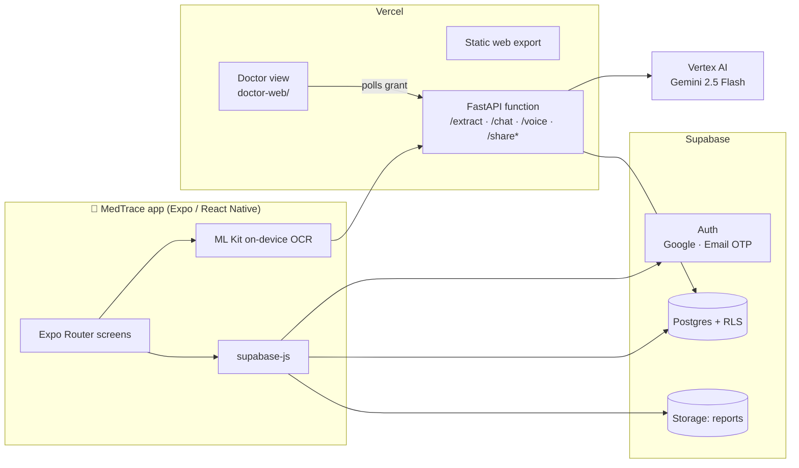
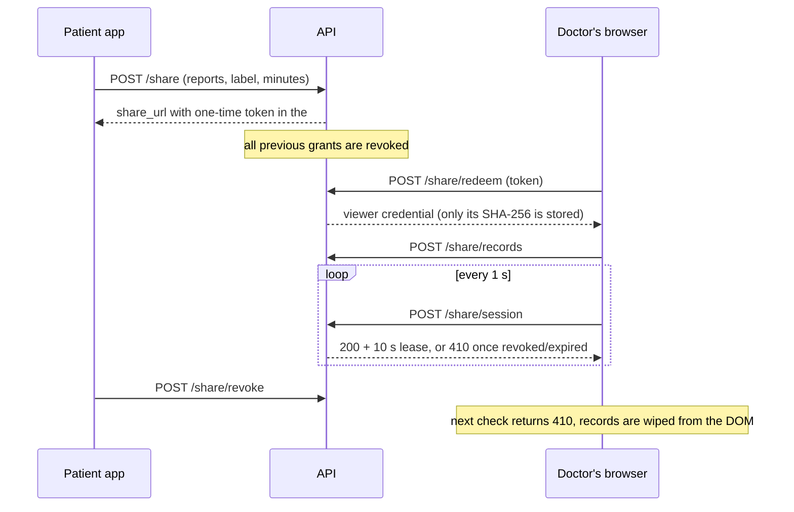

<p align="center">
  
</p>

<p align="center">
  <a href="https://github.com/Asthakumari009/medtrace/actions/workflows/quality.yml"></a>
  <a href="https://github.com/Asthakumari009/medtrace/releases/latest"></a>
  
  
  
</p>

---

**MedTrace** turns the paper trail of Indian healthcare (OPD slips, lab reports,
prescriptions, discharge summaries) into a structured, searchable medical record
that stays under the patient's control. Photograph a report and the phone reads it
on-device. Gemini extracts the clinical detail. You can ask questions grounded in
your own documents, then hand a doctor a **single-use, time-boxed, revocable** QR
view of exactly the reports you choose.

> **Status:** hackathon prototype (iQOO), running in production on Vercel +
> Supabase with a signed Android release. See [Releases](https://github.com/Asthakumari009/medtrace/releases/latest)
> for the APK.

## Contents

- [Features](#features)
- [Architecture](#architecture)
- [Doctor sharing: the security model](#doctor-sharing-the-security-model)
- [Tech stack](#tech-stack)
- [Getting started](#getting-started)
- [Configuration](#configuration)
- [Running and testing](#running-and-testing)
- [Deployment](#deployment)
- [Project structure](#project-structure)
- [Design system](#design-system)
- [Troubleshooting](#troubleshooting)
- [Further documentation](#further-documentation)

## Features

| | |
|---|---|
| **Add a report** | Camera, photo library, or PDF. Photos are read **on the device** with Google ML Kit text recognition; only the recognised text goes to the server. PDFs, and photos ML Kit can't read, fall back to cloud extraction. |
| **Clinical extraction** | Gemini 2.5 Flash on Vertex AI returns a strict, schema-validated record: lab values with units and printed reference ranges, abnormal flags, diagnoses, medications (dose, frequency, duration, including Indian dosing notation such as `1-0-1` / `0X5`), doctor, facility and report date. |
| **Report reader** | Every extracted value against its reference range, comparisons with earlier reports, and MedlinePlus context for each test. |
| **Grounded chat** | Ask about your records by text or voice. Answers are grounded in your own extracted documents, not general web knowledge. |
| **Doctor sharing** | Pick reports, a recipient label and a 5/15/30-minute window. The doctor scans a one-time QR and gets a live, read-only view that locks as soon as you revoke it. |
| **Sign-in** | Google (a native ID-token flow on Android, the OAuth redirect on the web) and email one-time codes, all through Supabase Auth. |
| **Local privacy** | Session and cached data are encrypted at rest on the device. Android backup is disabled. |
| **Languages** | English, Hindi and Telugu. |

## Architecture



- **One deployment, two artefacts.** `vercel.ts` serves the Expo web export as
  static files and routes the API paths to a single Python function
  (`api/index.py` → `api/main.py`). The mobile app's `EXPO_PUBLIC_API_URL` points
  at the root, so the API paths never move.
- **The database is the authority.** Every table is under Row Level Security, so
  the client reads its own rows directly. The API uses the secret key only for
  extraction writes and the share-grant flow. It never returns data the grant
  doesn't cover.
- **Extraction is strict.** Gemini's output is validated against Pydantic models
  (`api/schemas.py`). A malformed response is rejected, never partially stored.

## Doctor sharing: the security model



- The token travels in the URL **fragment**, so it never reaches HTTP access logs.
  It can be redeemed **once**. Scanning the QR a second time fails.
- The doctor page keeps records on screen only while it holds a **lease**. A
  revocation locks the view on the next check (about 1–2 s). If the connection
  drops, the records clear when the 10 s lease runs out. Hiding the tab or going
  offline clears them immediately.
- No signed file URLs are ever sent. They would outlive the revocable view.
- Responses are `no-store`, the page runs under a strict CSP with no inline
  script, and printing is disabled.
- **Limits, stated plainly:** a recipient label does not verify identity, and
  screenshots or photos of the screen cannot be recalled.

## Tech stack

| Layer | Choice |
|---|---|
| App | Expo SDK 57, React Native 0.86, React 19, Expo Router, Reanimated 4 |
| On-device OCR | `@infinitered/react-native-mlkit-text-recognition` |
| Auth | Supabase Auth, `@react-native-google-signin/google-signin` |
| Data | Supabase Postgres (RLS) and Storage |
| API | FastAPI (Python 3.11) on Vercel Functions |
| AI | Gemini 2.5 Flash on Vertex AI (`google-genai`) |
| i18n | i18next |
| Tests | `node:test` + tsx, Python `unittest`, Playwright (Chromium + WebKit) |
| CI | GitHub Actions ([`quality.yml`](.github/workflows/quality.yml)) |

## Getting started

### Prerequisites

- **Node.js 24** (npm 11). The lockfile is written by npm 11, so older npm versions fail `npm ci`.
- **Python 3.11+** for the API
- **Android Studio / SDK** and a device or emulator for native builds. The app
  uses native modules (ML Kit, Google Sign-In), so **it does not run in Expo Go**.
- A Supabase project and a Google Cloud project with Vertex AI enabled

### Install

```bash
git clone https://github.com/Asthakumari009/medtrace.git
cd medtrace
npm ci
pip install -r api/requirements.txt
cp .env.example .env            # app config (public values)
cp api/.env.example api/.env    # server secrets
```

### Database

Apply the migrations in `supabase/migrations/` in order. Use the Supabase CLI
(`supabase db push`) or run them in the SQL editor. They create the tables, RLS
policies, the `reports` storage bucket and the share-grant table.

## Configuration

### App (`.env`), compiled into the binary, **public**

| Variable | Purpose |
|---|---|
| `EXPO_PUBLIC_SUPABASE_URL` | Supabase project URL |
| `EXPO_PUBLIC_SUPABASE_ANON_KEY` | Publishable (anon) key |
| `EXPO_PUBLIC_API_URL` | API base URL. Use your LAN IP when testing on a phone, the production domain for release builds |
| `EXPO_PUBLIC_GOOGLE_WEB_CLIENT_ID` | Google **Web** OAuth client ID. If it's unset, the Google button is hidden |

### API (`api/.env` locally, Vercel env in production), **secret**

| Variable | Purpose |
|---|---|
| `SUPABASE_URL` | Supabase project URL |
| `SUPABASE_SECRET_KEY` | `sb_secret_…`. Bypasses RLS, **server only** |
| `GOOGLE_APPLICATION_CREDENTIALS` / credentials JSON | Vertex AI service account |
| `GOOGLE_CLOUD_PROJECT`, `GOOGLE_CLOUD_LOCATION` | Vertex AI project and region |
| `GEMINI_MODEL` | Defaults to `gemini-2.5-flash` |
| `VITA_ALLOWED_ORIGINS` | CORS allow-list for the web app |

> Never put `SUPABASE_SECRET_KEY` in `.env` or any `EXPO_PUBLIC_*` variable. It
> would ship inside the app.

### Sign-in providers

Both sign-in paths need dashboard configuration that fails **silently** when it's
missing. [`docs/AUTH.md`](docs/AUTH.md) walks through it step by step, with a check
for each step. In short:

1. Google Cloud: an **Android** OAuth client (`com.vita.health` + your signing
   SHA-1) **and** a **Web** client.
2. Supabase → Authentication → Providers → **Google: enabled**, put the Web
   client ID under *Client IDs*, and turn on *Skip nonce check*.
3. Supabase → Email: the OTP length matches the app (8 digits).

## Running and testing

```bash
# API, locally on :8000
cd api && uvicorn main:app --reload --host 0.0.0.0 --port 8000

# App on a connected Android device (dev client)
npm run android          # first build
npm run dev:device       # later sessions

# Web
npm run web
```

The full gate, the same one CI runs:

```bash
npm run typecheck && npm test && npm run test:api && npm run test:e2e
npm run export:web
```

| Suite | Covers |
|---|---|
| `npm test` | Pure TypeScript logic (`tests/*.test.ts`) |
| `npm run test:api` | Extraction validation, clinical parsing, share-grant lifecycle, ownership checks |
| `npm run test:e2e` | Doctor view lock-on-revoke, lease expiry, stale-response races, and a mobile layout matrix across Chromium and WebKit |

On-device helpers: `npm run logs:device`, `npm run shot:device`,
`npm run perf:device`. See [`docs/DEVICE.md`](docs/DEVICE.md).

### Release APK

```bash
npm run prebuild:android
cd android && ./gradlew assembleRelease
npm run check:release     # refuses builds with dev-only screens or a localhost API URL
```

`android/` is prebuild output. Never edit it by hand; change `app.json` or a
config plugin instead.

## Deployment

Production runs on Vercel from `vercel.ts`. Full runbook:
[`docs/DEPLOY.md`](docs/DEPLOY.md). After every deploy:

```bash
npm run check:deploy      # catches the failures that don't error: wrong API URL, missing routes, protection walls
```

## Project structure

```
app/                  Expo Router screens: (auth), (tabs), report/[id], preview
src/
  components/         Feature components (ShareSheet, ReportReader, …)
  lib/                Supabase client, OCR, reports, share, googleAuth, http
  providers/          Auth and theme providers
  ui/                 Design system: theme.ts is the single source of truth
  i18n/               en, hi, te
api/                  FastAPI: extraction, chat/voice, sharing (+ tests)
doctor-web/           The doctor's read-only view (static, strict CSP)
supabase/migrations/  Schema, RLS, storage, share grants
tests/                Unit tests and Playwright e2e
scripts/              Release/deploy gates, brand asset renderer
assets/brand/         Logo sources (mark.svg, icon.svg) and README banner
docs/                 AUTH, DEPLOY, DEVICE, PERF, SCOPE
```

## Design system

`src/ui/theme.ts` holds every colour, size, radius and duration. Near-black
canvas, flat surfaces, **one** acid-lime accent per screen, Geist type, and
tabular numerals for every value. Motion is `withTiming` only: no springs, nothing
over 260 ms, nothing ambient.

The logo is a vital-sign trace whose spike forms an **M**, ending in a single
point: the record being traced. Every icon size is generated from one source:

```bash
node scripts/render-brand.cjs
```

## Troubleshooting

| Symptom | Cause and fix |
|---|---|
| Google button does nothing, or sign-in fails with *provider is not enabled* | Google provider is off in Supabase, or the Web client ID isn't listed under *Client IDs*. See [AUTH.md](docs/AUTH.md) §2. |
| Google picker closes with `DEVELOPER_ERROR` | The SHA-1 of the signing key that built the APK isn't on the Android OAuth client. |
| Email code rejected as expired | App and Supabase disagree on OTP length. |
| Doctor view says *Connection lost* | The doctor's network dropped for longer than the 10 s lease. Mint a new QR. |
| Share or extract returns 405 in production | A path is missing from `API_PATHS` in `vercel.ts`. The bare path (`/share`) must be listed as well as `/share/(.*)`. |
| `npm ci` fails with *lock file out of sync* | You're on npm 10. Use Node 24 / npm 11. |

## Further documentation

- [`docs/SCOPE.md`](docs/SCOPE.md): what the app deliberately does **not** do
- [`docs/AUTH.md`](docs/AUTH.md): sign-in setup
- [`docs/DEPLOY.md`](docs/DEPLOY.md): Vercel deployment runbook
- [`docs/DEVICE.md`](docs/DEVICE.md): the on-device development loop
- [`docs/PERF.md`](docs/PERF.md): performance budget

## Disclaimer

MedTrace organises and explains medical documents. It is **not** a medical device
and does not provide diagnosis or treatment advice. Always consult a qualified
clinician.

## License

[MIT](LICENSE) © 2026 Syed Saad Ur Rahman
